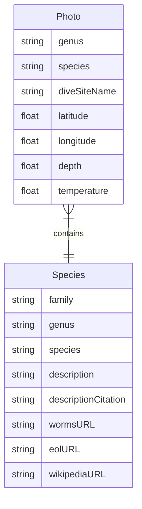

# Data model

To keep the data model simple metadata will only be produce per species and per photo. Family and genus pages can be derived from the species metadata.

```mermaid
erDiagram
    Species {
        string family
        string genus
        string species
        string description
        string descriptionCitation
        string wormsURL
        string eolURL
        string wikipediaURL
    }
    Photo }|--|| Species: contains
    Photo {
        string genus
        string species
        string diveSiteName
        float latitude
        float longitude
        float depth
        float temperature
    }
```